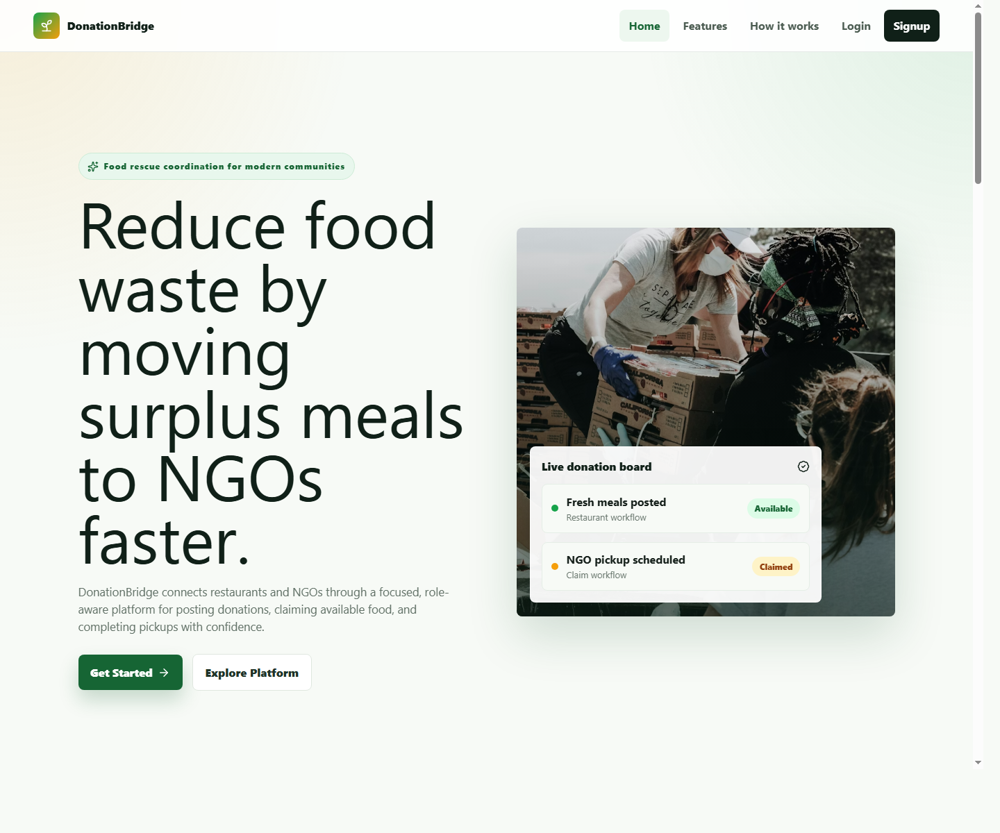
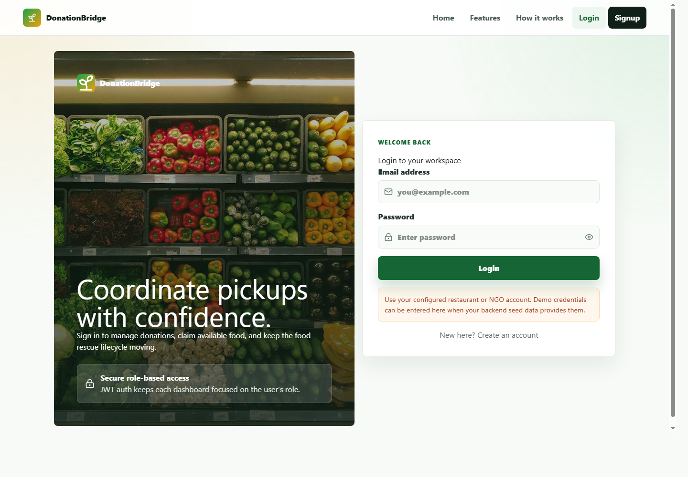

# DonationBridge - Full-Stack MERN Food Donation Platform

DonationBridge is a production-style MERN platform that connects restaurants with NGOs to reduce food waste. Restaurants post surplus food donations, NGOs claim available listings, and restaurants confirm final pickup through a controlled donation lifecycle.

```txt
available -> claimed -> collected
```

The latest frontend upgrade turns the project into a polished SaaS-style product experience with a professional landing page, responsive navigation, redesigned authentication, role-aware dashboards, search/filter donation boards, status badges, loading states, empty states, toast notifications, and subtle motion.

## Screenshots





## Live Links

| Resource | URL |
| --- | --- |
| Live App | https://donation-bridge-iota.vercel.app |
| Backend API | https://donation-bridge-api.onrender.com |
| Swagger Docs | https://donation-bridge-api.onrender.com/api-docs |

## Tech Stack

### Frontend

- React + Vite
- React Router
- Axios
- Context API
- Tailwind CSS
- Framer Motion
- Lucide React icons
- Responsive custom CSS design system
- Vercel deployment

### Backend

- Node.js + Express.js
- MongoDB + Mongoose
- JWT authentication
- bcrypt password hashing
- Role-based middleware
- Swagger UI
- express-rate-limit
- Render deployment

## Product Features

- Professional public landing page with hero, feature, workflow, role explanation, testimonial-style proof, CTA, and footer sections
- Mobile-responsive navbar with public and authenticated navigation states
- Split-screen login and signup pages with validation, password visibility toggles, loading states, and branded visuals
- JWT-based authentication preserved through the existing Context API flow
- Restaurant dashboard with live donation metrics, recent activity, and quick actions
- NGO dashboard with available donation metrics, claimed pickup timeline, and quick actions
- Donation cards with food imagery, quantity, pickup location, expiry time, restaurant information, status badges, and role-specific CTA buttons
- Search, status filters, and sorting for donation management screens
- Skeleton loading states, polished empty states, inline errors, and toast notifications
- Fully responsive layouts for mobile, tablet, and desktop

## User Roles

### Restaurant

Restaurants can:

- Create food donations
- View their own donations
- Track donation status
- Mark claimed donations as collected

### NGO

NGOs can:

- View available donations
- Claim a donation
- View claimed donations
- Track pickup status

## Donation Lifecycle

```txt
Restaurant creates donation
        |
        v
Status: available
        |
        v
NGO claims donation
        |
        v
Status: claimed
        |
        v
Restaurant confirms pickup
        |
        v
Status: collected
```

Lifecycle rules:

- Only restaurants can create donations.
- Only NGOs can claim donations.
- A donation can only be claimed if it is available.
- A restaurant can only mark its own claimed donation as collected.
- Collected donations complete the workflow.

## API Endpoints

Base API URL:

```txt
https://donation-bridge-api.onrender.com/api/v1
```

### Authentication

| Method | Endpoint | Access | Description |
| --- | --- | --- | --- |
| POST | `/auth/signup` | Public | Register a restaurant or NGO |
| POST | `/auth/login` | Public | Login and receive JWT token |

### Restaurant Routes

| Method | Endpoint | Access | Description |
| --- | --- | --- | --- |
| POST | `/donation/create` | Restaurant | Create a donation |
| GET | `/donation/my-donations` | Restaurant | View own donations |
| PATCH | `/donation/:id/collect` | Restaurant | Mark donation as collected |

### NGO Routes

| Method | Endpoint | Access | Description |
| --- | --- | --- | --- |
| GET | `/donation/available` | NGO | View available donations |
| POST | `/donation/:id/claim` | NGO | Claim a donation |
| GET | `/donation/claimed` | NGO | View claimed donations |

## Example API Request

```http
POST /api/v1/donation/create
Authorization: Bearer <jwt_token>
Content-Type: application/json
```

```json
{
  "foodName": "Cooked Rice",
  "quantity": "50 plates",
  "location": "Sector 18, Noida",
  "pickupBy": "2026-04-05T20:31:58.857Z"
}
```

## Project Structure

```txt
DonationBridge/
|-- index.js
|-- package.json
|-- README.md
|-- docs/
|   |-- screenshots/
|-- src/
|   |-- app.js
|   |-- config/
|   |-- controllers/
|   |-- middleware/
|   |-- models/
|   |-- routes/
|-- frontend/
    |-- index.html
    |-- package.json
    |-- vite.config.js
    |-- vercel.json
    |-- src/
        |-- App.jsx
        |-- main.jsx
        |-- styles.css
        |-- api/
        |-- components/
        |-- context/
        |-- pages/
        |-- utils/
```

## Local Setup

### 1. Clone the repository

```bash
git clone https://github.com/devR1shabh/Donation-Bridge
cd Donation-Bridge
```

### 2. Configure backend environment variables

Create a `.env` file in the root directory:

```env
PORT=5000
DATABASE_URL=your_mongodb_connection_string
JWT_SECRET=your_jwt_secret
CLIENT_URL=http://localhost:5173
```

### 3. Install and run backend

```bash
npm install
npm run dev
```

Backend runs on:

```txt
http://localhost:5000
```

### 4. Configure frontend environment variables

Create `frontend/.env`:

```env
VITE_API_BASE_URL=http://localhost:5000/api/v1
```

If this variable is omitted, the frontend falls back to the deployed Render API.

### 5. Install and run frontend

```bash
cd frontend
npm install
npm run dev
```

Frontend runs on:

```txt
http://localhost:5173
```

## Production Environment Variables

### Render Backend

```env
PORT=10000
DATABASE_URL=your_mongodb_connection_string
JWT_SECRET=your_jwt_secret
CLIENT_URL=https://donation-bridge-iota.vercel.app
```

### Vercel Frontend

```env
VITE_API_BASE_URL=https://donation-bridge-api.onrender.com/api/v1
```

## Deployment

### Backend on Render

```txt
Build Command: npm install
Start Command: node index.js
```

### Frontend on Vercel

```txt
Framework Preset: Vite
Root Directory: frontend
Build Command: npm run build
Output Directory: dist
Install Command: npm install
```

## Quality Checks

Run frontend checks from `frontend/`:

```bash
npm run lint
npm run build
```

## Security Features

- Passwords hashed with bcrypt
- JWT authentication
- Protected API routes
- Role-based route access
- Environment variables for secrets
- CORS configured for production frontend
- API rate limiting

## Tested Flows

- Restaurant signup and login
- Restaurant donation creation
- Restaurant view own donations
- NGO signup and login
- NGO view available donations
- NGO claim donation
- NGO view claimed donations
- Restaurant mark donation as collected
- Full lifecycle from available to claimed to collected

## Future Improvements

- Add unit and integration tests using Jest and Supertest
- Add donation image upload support
- Add pickup reminder notifications
- Add admin analytics endpoints and dashboard
- Dockerize the full-stack application

## Author

Rishabh Vyas

- GitHub: https://github.com/devR1shabh
- LinkedIn: https://www.linkedin.com/in/rishabhvyas-dev
- Email: rishavvyas74@gmail.com
